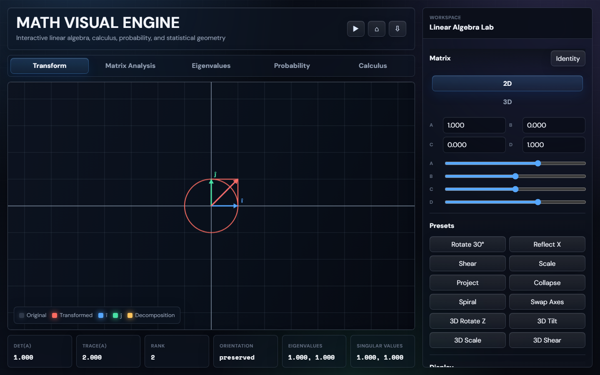
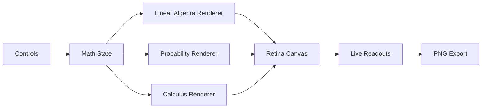

<div align="center">

<h1>Math Visual Engine</h1>

<p><strong>An interactive browser lab for linear algebra, calculus, probability, and statistical geometry.</strong></p>

<p>Explore transformations, decompositions, distributions, derivatives, integrals, and 3D surfaces through a polished canvas workspace built with plain HTML, CSS, and JavaScript.</p>

<p>
  
  
  
  
</p>



</div>

## Overview

Math Visual Engine is a single-page math visualization studio. It is designed for fast experimentation: change a matrix, drag a surface, probe a distribution interval, or export the canvas as a PNG without installing dependencies or waiting for a build pipeline.

The app is especially useful when you want mathematical objects to feel spatial and interactive instead of static.

## Core Workspaces

| Workspace | What you can explore |
| --- | --- |
| **Transform** | 2D and 3D matrix transformations, animated interpolation, basis vectors, grids, unit shapes, sample points, and vector probes. |
| **Matrix Analysis** | Determinant, trace, rank, invertibility, orientation, singular values, SVD geometry, and area scaling. |
| **Eigenvalues** | Real eigen-directions, eigendecomposition behavior, diagonalization status, and geometric intuition. |
| **Probability** | PDF/PMF and CDF views, interval probabilities, distribution overlays, mixtures, variable relationships, and F-distribution derivation. |
| **Calculus** | 1D function graphs, symbolic/numeric derivatives, antiderivatives where supported, integral shading, 2D surfaces, tangent planes, and gradient flow. |

## Visual System



## Highlights

- **Zero setup:** open `index.html` directly in a browser.
- **No framework dependency:** the entire experience is vanilla HTML, CSS, and JavaScript.
- **Retina-aware rendering:** canvas output stays sharp on high-density displays.
- **Interactive controls:** drag, zoom, animate, probe, rotate, roll, and export.
- **Hybrid math engine:** uses exact symbolic forms where practical and falls back to numerical methods when needed.
- **Teaching-friendly readouts:** formulas and interpretations update as the visualization changes.

## Quick Start

Clone or download the repository, then open:

```text
index.html
```

No package manager, bundler, or local server is required.

## Example Inputs

Calculus accepts compact and explicit forms:

```text
sinx
sin(x)
cos(x)
sigmoid
tanh
relu
softplus
gaussian
sin(x)*cos(y)
exp(-(x^2+y^2))
```

Matrix presets include rotation, reflection, shear, scaling, projection, singular collapse, spiral, axis swap, and 3D transformations.

Probability relationships include overlays, mixtures, variable sums, products, ratios, standardization, and:

```text
(X / d1) / (Y / d2) ~ F(d1, d2)
```

## Controls

| Area | Interaction |
| --- | --- |
| Matrix canvas | Drag to pan; use the mouse wheel to zoom. |
| Animation | Use play/pause and interpolation speed controls. |
| Calculus surfaces | Drag to rotate; Shift + drag or Shift + wheel to roll. |
| Probability plots | Move the pointer over the plot to inspect values. |
| Export | Use **Export PNG** to save the current canvas. |

## Project Structure

```text
.
|-- index.html
|-- styles.css
|-- script.js
|-- docs/
|   `-- preview.png
|-- LICENSE
`-- README.md
```

## Design Notes

The symbolic system is intentionally practical rather than exhaustive. When an exact expression is supported, the app displays it. Otherwise, it falls back to numerical derivatives, partial derivatives, integrals, and local linear approximations so exploration stays fluid.

## License

Released under the [MIT License](LICENSE).

Maintained by royayush27.
